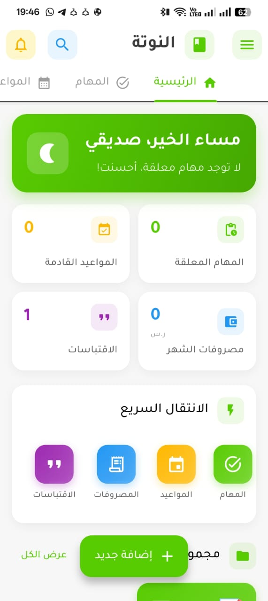

<div align="center">

# 📝 Nota Website


### The Official Landing Page for Nota - AI-Powered Smart Notes App

A stunning, modern, and responsive website showcasing the intelligent notes application powered by Google Gemini 2.5 Flash AI.

<br>

[](https://nota-app.vercel.app)
[](https://drive.google.com/file/d/1xdUr_jCQfuR9W_74YBoAmaC08SI3zzO7/view?usp=sharing)
[](https://github.com/Lord-shaban/Nota)

<br>

[](https://developer.mozilla.org/en-US/docs/Web/HTML)
[](https://developer.mozilla.org/en-US/docs/Web/CSS)
[](https://developer.mozilla.org/en-US/docs/Web/JavaScript)
[](https://vercel.com)
[](LICENSE)
[](CONTRIBUTING.md)

<br>

[**🌐 View Live Demo**](https://nota-app.vercel.app) •
[**📱 Download APK**](https://drive.google.com/file/d/1xdUr_jCQfuR9W_74YBoAmaC08SI3zzO7/view?usp=sharing) •
[**🐛 Report Bug**](https://github.com/Lord-shaban/nota-website/issues) •
[**💡 Request Feature**](https://github.com/Lord-shaban/nota-website/issues)

</div>

---

## 📋 Table of Contents

<details>
<summary>Click to expand</summary>

- [Overview](#-overview)
- [Demo](#-demo)
- [Features](#-features)
- [Website Sections](#-website-sections)
- [Tech Stack](#%EF%B8%8F-tech-stack)
- [Project Structure](#-project-structure)
- [Getting Started](#-getting-started)
  - [Prerequisites](#prerequisites)
  - [Installation](#installation)
  - [Running Locally](#running-locally)
- [Deployment](#-deployment)
- [About Nota App](#-about-nota-app)
- [Performance](#-performance)
- [Browser Support](#-browser-support)
- [Contributing](#-contributing)
- [Changelog](#-changelog)
- [License](#-license)
- [Acknowledgments](#-acknowledgments)
- [Contact](#-contact)

</details>

---

## 🎯 Overview

**Nota Website** is the official landing page and download portal for the Nota application - an AI-powered smart notes app built with Flutter. This website serves as the primary touchpoint for users to:

- ✨ **Discover** - Learn about Nota's powerful AI-driven features
- 📱 **Download** - Get the Android APK directly
- 📖 **Understand** - See how the intelligent input system works
- 🔗 **Connect** - Access the main app repository and documentation

The website is built with modern web technologies and features a stunning dark theme with glassmorphism effects that match the Nota app's visual identity.

---

## 🎬 Demo

<div align="center">

### 🖥️ Desktop View



### 📱 Mobile Responsive

The website is fully responsive and optimized for all screen sizes.

</div>

---

## ✨ Features

### 🎨 Design Excellence

| Feature | Description |
|:--------|:------------|
| 🔮 **Glassmorphism UI** | Modern glass-like effects with backdrop blur and transparency |
| 🌊 **Floating Animations** | Elegant floating feature cards around the phone mockup |
| ✨ **Gradient Borders** | Beautiful gradient border effects throughout the UI |
| 💫 **Glow Effects** | Signature green (#58CC02) glow effects matching the app |
| 🔄 **AI Visualization** | Animated rings around AI icon showcasing intelligence |
| 🎬 **Scroll Animations** | Smooth animations triggered by Intersection Observer |
| 🌌 **Animated Background** | Dynamic orbs and grid overlay for depth |

### ⚙️ Technical Excellence

| Feature | Description |
|:--------|:------------|
| 📱 **Fully Responsive** | Optimized for desktop, tablet, and mobile devices |
| 🌙 **Dark Theme** | Elegant dark mode that's easy on the eyes |
| 🇸🇦 **RTL Support** | Complete Arabic language and right-to-left layout support |
| ⚡ **Performance** | Optimized assets and lazy loading for fast page loads |
| ♿ **Accessibility** | WCAG 2.1 compliant with semantic HTML and ARIA labels |
| 🔍 **SEO Optimized** | Meta tags, Open Graph, and structured data support |
| 📊 **Analytics Ready** | Easy integration with Google Analytics or similar |

---

## 📑 Website Sections

The website is organized into carefully designed sections:

| # | Section | Description |
|:-:|:--------|:------------|
| 1 | **🏠 Hero** | Eye-catching hero with phone mockup, floating cards, and CTAs |
| 2 | **📋 About** | App introduction with 4 category cards (Tasks, Appointments, Expenses, Notes) |
| 3 | **✨ Features** | Key features showcase with animated AI visualization |
| 4 | **📖 How It Works** | 3-step guide with practical examples |
| 5 | **📸 Screenshots** | Interactive carousel gallery of app screens |
| 6 | **🔐 Authentication** | Display of 6 supported authentication methods |
| 7 | **🛠️ Tech Stack** | Technologies used in the Nota app |
| 8 | **📥 Download** | Prominent download section with direct APK link |
| 9 | **📄 Footer** | Links, social media, and credits |

---

## 🛠️ Tech Stack

This website is built with vanilla web technologies for maximum performance and simplicity:

<table>
<tr>
<td align="center" width="120">

<br><strong>HTML5</strong>
<br><sub>Semantic Structure</sub>
</td>
<td align="center" width="120">

<br><strong>CSS3</strong>
<br><sub>Modern Styling</sub>
</td>
<td align="center" width="120">

<br><strong>JavaScript</strong>
<br><sub>Interactivity</sub>
</td>
<td align="center" width="120">

<br><strong>Vercel</strong>
<br><sub>Deployment</sub>
</td>
</tr>
</table>

### Additional Technologies

- **[Font Awesome 6.5](https://fontawesome.com/)** - Icon library
- **[Google Fonts](https://fonts.google.com/)** - Tajawal (Arabic) & Inter fonts
- **[CSS Variables](https://developer.mozilla.org/en-US/docs/Web/CSS/Using_CSS_custom_properties)** - Theming and consistency
- **[CSS Grid & Flexbox](https://css-tricks.com/snippets/css/complete-guide-grid/)** - Responsive layouts
- **[Intersection Observer API](https://developer.mozilla.org/en-US/docs/Web/API/Intersection_Observer_API)** - Scroll animations

---

## 📁 Project Structure

```
nota-website/
│
├── 📄 index.html              # Main HTML page (single-page application)
├── 📄 vercel.json             # Vercel deployment configuration
├── 📄 README.md               # Project documentation (this file)
├── 📄 LICENSE                 # MIT License
├── 📄 CONTRIBUTING.md         # Contribution guidelines
├── 📄 CODE_OF_CONDUCT.md      # Community code of conduct
├── 📄 CHANGELOG.md            # Version history
├── 📄 SECURITY.md             # Security policy
├── 📄 .gitignore              # Git ignore rules
│
├── 📁 css/
│   └── 🎨 style.css           # Complete stylesheet (~1500+ lines)
│                               # - CSS Variables for theming
│                               # - Responsive breakpoints
│                               # - Animations & transitions
│                               # - Glassmorphism effects
│
├── 📁 js/
│   └── ⚙️ main.js             # JavaScript functionality
│                               # - Navigation handling
│                               # - Scroll animations
│                               # - Carousel functionality
│                               # - Mobile menu toggle
│
├── 📁 images/
│   ├── 🖼️ logo.png            # Nota app logo
│   ├── 🖼️ favicon.png         # Browser tab icon
│   ├── 🖼️ og-image.png        # Social media share image
│   ├── 🖼️ app-preview.png     # App preview for README
│   │
│   └── 📁 screenshots/        # App screenshots for carousel
│       ├── splash.png         # Splash screen
│       ├── login.png          # Login screen
│       ├── register.png       # Registration screen
│       ├── Dashboard.png      # Main dashboard
│       ├── ai_input.png       # AI input screen
│       ├── tasks.png          # Tasks screen
│       ├── appointments.png   # Appointments screen
│       ├── track-money.png    # Expenses tracking
│       ├── qoutes.png         # Quotes screen
│       └── forgot_password.png# Password recovery
│
└── 📁 .github/                # GitHub specific files
    ├── 📁 ISSUE_TEMPLATE/     # Issue templates
    │   ├── bug_report.md
    │   └── feature_request.md
    └── 📄 PULL_REQUEST_TEMPLATE.md
```

---

## 🚀 Getting Started

### Prerequisites

Before you begin, ensure you have the following:

- ✅ A modern web browser (Chrome, Firefox, Safari, Edge)
- ✅ [Git](https://git-scm.com/) installed on your machine
- ✅ A code editor ([VS Code](https://code.visualstudio.com/) recommended)
- ✅ [Live Server extension](https://marketplace.visualstudio.com/items?itemName=ritwickdey.LiveServer) (optional, for development)

### Installation

1. **Clone the repository**

   ```bash
   git clone https://github.com/Lord-shaban/nota-website.git
   ```

2. **Navigate to the project directory**

   ```bash
   cd nota-website
   ```

3. **Open in your code editor**

   ```bash
   code .
   ```

### Running Locally

#### Option 1: Direct Browser (Simple)

Simply open `index.html` in your web browser:

```bash
# Windows
start index.html

# macOS
open index.html

# Linux
xdg-open index.html
```

#### Option 2: VS Code Live Server (Recommended)

1. Install the [Live Server extension](https://marketplace.visualstudio.com/items?itemName=ritwickdey.LiveServer)
2. Right-click on `index.html`
3. Select **"Open with Live Server"**
4. Browser will open at `http://localhost:5500`

#### Option 3: Python HTTP Server

```bash
# Python 3
python -m http.server 8000

# Then open http://localhost:8000
```

#### Option 4: Node.js HTTP Server

```bash
# Install globally (once)
npm install -g http-server

# Run server
http-server -p 8000

# Then open http://localhost:8000
```

---

## 🌐 Deployment

### Vercel (Recommended)

This website is deployed on **Vercel** for automatic deployments on every push.

#### One-Click Deploy

[](https://vercel.com/new/clone?repository-url=https://github.com/Lord-shaban/nota-website)

#### Manual Deployment

1. Fork this repository
2. Go to [vercel.com](https://vercel.com/) and sign in
3. Click "New Project"
4. Import your forked repository
5. Deploy automatically!

### Alternative Platforms

| Platform | Instructions |
|:---------|:-------------|
| **GitHub Pages** | Enable in Settings → Pages → Select main branch |
| **Netlify** | Connect repo at [netlify.com](https://netlify.com) |
| **Firebase Hosting** | Use `firebase init hosting` and `firebase deploy` |
| **Cloudflare Pages** | Connect at [pages.cloudflare.com](https://pages.cloudflare.com) |

---

## 📱 About Nota App

<div align="center">


**Nota** is an AI-powered smart notes application that revolutionizes how you capture and organize information.

</div>

### 🌟 Key Features

| Feature | Description |
|:--------|:------------|
| 🤖 **AI-Powered Classification** | Powered by Google Gemini 2.5 Flash for intelligent categorization |
| 📝 **4 Smart Categories** | Automatically sorts into Tasks, Appointments, Expenses, and Notes |
| 🎤 **Multiple Input Methods** | Text, Voice, Camera, and Gallery support |
| 🔐 **6 Auth Methods** | Email, Google, Facebook, GitHub, Apple, and Biometric |
| ☁️ **Cloud Sync** | Firebase-powered synchronization across devices |
| 🌍 **Bilingual** | Full Arabic and English language support |
| 🎨 **Beautiful UI** | Modern design with dark theme and smooth animations |

### 💻 Tech Stack (App)

- **Framework:** Flutter (Dart)
- **Backend:** Firebase (Authentication, Firestore, Storage)
- **AI:** Google Gemini 2.5 Flash
- **State Management:** GetX

### ⬇️ Download

<div align="center">

| Platform | Link | Requirements |
|:--------:|:----:|:-------------|
| 📱 Android | [**Download APK**](https://drive.google.com/file/d/1xdUr_jCQfuR9W_74YBoAmaC08SI3zzO7/view?usp=sharing) | Android 5.0+ (~30 MB) |
| 🍎 iOS | Coming Soon | - |

</div>

---

## ⚡ Performance

The website is optimized for performance:

| Metric | Score |
|:-------|:------|
| 🟢 Performance | 95+ |
| 🟢 Accessibility | 100 |
| 🟢 Best Practices | 100 |
| 🟢 SEO | 100 |

*Scores based on Lighthouse audit*

### Optimization Techniques

- ✅ Optimized images with appropriate formats
- ✅ Minified CSS and JavaScript in production
- ✅ Font preloading for faster text rendering
- ✅ Lazy loading for images below the fold
- ✅ Efficient CSS selectors and minimal repaints
- ✅ Gzip compression enabled on Vercel

---

## 🌍 Browser Support

| Browser | Version |
|:-------:|:-------:|
|  Chrome | 90+ |
|  Firefox | 88+ |
|  Safari | 14+ |
|  Edge | 90+ |
|  Opera | 76+ |

---

## 🤝 Contributing

Contributions are what make the open source community such an amazing place to learn, inspire, and create. Any contributions you make are **greatly appreciated**.

Please read our [Contributing Guidelines](CONTRIBUTING.md) and [Code of Conduct](CODE_OF_CONDUCT.md) before getting started.

### Quick Start

```bash
# 1. Fork the repository

# 2. Clone your fork
git clone https://github.com/YOUR-USERNAME/nota-website.git

# 3. Create a feature branch
git checkout -b feature/amazing-feature

# 4. Make your changes and commit
git commit -m "feat: add amazing feature"

# 5. Push to your fork
git push origin feature/amazing-feature

# 6. Open a Pull Request
```

### Contribution Ideas

- 🌐 Add more language translations
- 🎨 Create new themes or color schemes
- ♿ Improve accessibility features
- 📱 Enhance mobile responsiveness
- ⚡ Performance optimizations
- 📝 Documentation improvements

---

## 📝 Changelog

See [CHANGELOG.md](CHANGELOG.md) for a detailed history of changes.

### Recent Updates

- **v1.0.0** - Initial release with full landing page

---

## 📜 License

This project is licensed under the **MIT License** - see the [LICENSE](LICENSE) file for details.

```
MIT License

Copyright (c) 2026 Lord Shaban

Permission is hereby granted, free of charge, to any person obtaining a copy
of this software and associated documentation files (the "Software"), to deal
in the Software without restriction, including without limitation the rights
to use, copy, modify, merge, publish, distribute, sublicense, and/or sell
copies of the Software...
```

---

## 🙏 Acknowledgments

Special thanks to:

- 🤖 **Google Gemini** - For powering the AI features in Nota
- 🎨 **Font Awesome** - For the beautiful icons
- 📝 **Google Fonts** - For Tajawal and Inter fonts
- 🚀 **Vercel** - For seamless deployment
- 💙 **Flutter Team** - For the amazing framework
- 👥 **Open Source Community** - For inspiration and support

---

## 📬 Contact

**Lord Shaban** - Project Maintainer

| Platform | Link |
|:---------|:-----|
| 🐙 GitHub | [@Lord-shaban](https://github.com/Lord-shaban) |
| 📧 Email | [Contact via GitHub](https://github.com/Lord-shaban) |

### Project Links

| Resource | Link |
|:---------|:-----|
| 🌐 **Live Website** | [nota-app.vercel.app](https://nota-app.vercel.app) |
| 📱 **Download APK** | [Google Drive](https://drive.google.com/file/d/1xdUr_jCQfuR9W_74YBoAmaC08SI3zzO7/view?usp=sharing) |
| 📦 **Main App Repo** | [github.com/Lord-shaban/Nota](https://github.com/Lord-shaban/Nota) |
| 🐛 **Issues** | [Report Bug](https://github.com/Lord-shaban/nota-website/issues) |
| 💡 **Features** | [Request Feature](https://github.com/Lord-shaban/nota-website/issues) |

---

<div align="center">

### ⭐ Star this repository if you find it helpful!

**Made with 💚 using HTML, CSS & JavaScript**

<br>

[](https://github.com/Lord-shaban/nota-website/stargazers)
[](https://github.com/Lord-shaban/nota-website/network/members)
[](https://github.com/Lord-shaban/nota-website/watchers)

<br>

[🔝 Back to Top](#-nota-website)

</div>
